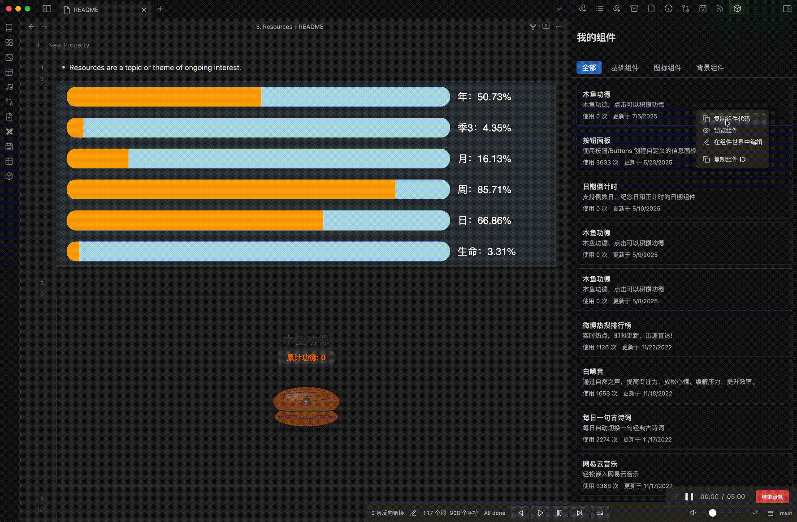

# <div align="center">Widget Store for Obsidian</div>

<div align="center">
  
  [](https://github.com/kuai-dian/obsidian/releases/latest)
  [](https://github.com/kuai-dian/obsidian/releases)
  [](https://github.com/kuai-dian/obsidian/stargazers)
  [](https://github.com/kuai-dian/obsidian/blob/main/LICENSE)
  
</div>

<div align="center">
  <h3>🌟 将 <a href="https://cn.widgetstore.net">组件世界</a> 的丰富组件资源直接集成到 Obsidian 中 🌟</h3>
</div>

<div align="center">
  <br />
  
  <br />
  <br />
</div>

<div align="center">
  
  ### ⭐ 如果这个项目对你有帮助，请给个 Star 支持一下！ ⭐
  
  <a href="https://github.com/kuai-dian/obsidian/stargazers">
    
  </a>
  
  <br />
  <br />
</div>

---

## ✨ 功能特性

<table>
  <tr>
    <td width="50%">
      
### 🔐 安全认证
- OAuth 2.0 安全登录
- 自动刷新 Token
- 隐私数据保护

### 🎨 组件管理
- 浏览公开组件库
- 管理个人收藏
- 快速搜索定位

</td>
<td width="50%">

### 📝 便捷操作
- 多种插入方式
- 实时预览效果
- 复制组件代码

### 🔧 灵活配置
- 自定义组件尺寸
- 多种渲染格式
- 深色模式支持

</td>
</tr>
</table>

---

## 📦 安装

### 🔧 手动安装

1. 从 [Releases](https://github.com/kuai-dian/obsidian/releases/latest) 下载最新版本 `widgetstore-*.zip`
2. 解压到 Obsidian 插件目录：`<vault>/.obsidian/plugins/widgetstore/`
3. 重启 Obsidian
4. 在 `设置 → 社区插件` 中启用 **Widget Store**

### 🏪 从社区插件安装

> 🚧 正在提交到 Obsidian 社区插件市场，敬请期待...

---

## 🚀 快速开始

### 1️⃣ 登录认证

<div align="center">
  
  
  
</div>

### 2️⃣ 使用组件

#### 📋 方式一：组件代码块（推荐）

````markdown
```widgetstore
组件ID
```
````

#### 📱 方式二：右键菜单
在编辑器中右键 → 选择"插入组件"

#### 🖱️ 方式三：组件管理器
从"我的组件"中选择并插入

---

## ⚙️ 设置选项

<div align="center">

| 设置项 | 说明 | 默认值 |
|:---:|:---:|:---:|
| 🎯 默认插入格式 | widgetstore / iframe / html | widgetstore |
| 📏 组件宽度 | 支持 px、%、vw 等单位 | 100% |
| 📐 组件高度 | 支持 px、vh 等单位 | 400px |

</div>

---

## 💻 开发

### 环境准备

```bash
# 克隆项目
git clone https://github.com/kuai-dian/obsidian.git
cd obsidian

# 安装依赖
yarn install

# 初始化开发环境
node setup-dev.mjs
```

### 开发命令

```bash
# 开发模式（监听文件变化）
yarn dev

# 开发模式（自动同步到 Obsidian）
yarn dev:obsidian

# 生产构建
yarn build
```

### 项目结构

```
📦 widgetstore-obsidian
├── 📄 main.ts              # 插件主入口
├── 📁 src/
│   ├── 📁 api/            # API 接口层
│   │   ├── 📄 auth.ts     # OAuth 认证
│   │   ├── 📄 widget.ts   # 组件接口
│   │   └── 📄 types.ts    # 类型定义
│   └── 📁 views/          # 视图组件
│       └── 📄 MyWidgets.ts # 组件管理视图
├── 📄 styles.css          # 全局样式
├── 📄 manifest.json       # 插件元数据
└── 📄 package.json        # 项目配置
```

---

## 🤝 贡献指南

我们欢迎所有形式的贡献！无论是新功能、Bug 修复还是文档改进。

<div align="center">

[](https://github.com/kuai-dian/obsidian/pulls)
[](https://github.com/kuai-dian/obsidian/issues)

</div>

请查看 [贡献指南](CONTRIBUTING.md) 了解提交规范。

---

## 📞 联系与支持

<div align="center">

| 渠道 | 链接 |
|:---:|:---|
| 💬 问题反馈 | [GitHub Issues](https://github.com/kuai-dian/obsidian/issues) |
| 🌐 官方网站 | [https://cn.widgetstore.net](https://cn.widgetstore.net) |
| 📋 更新日志 | [CHANGELOG.md](CHANGELOG.md) |

</div>

---

## 📄 许可证

<div align="center">

本项目采用专有许可证 - 保留所有权利

[](./LICENSE)

**⚠️ 重要说明 ⚠️**

- 🚫 **禁止商业使用** - 本软件仅供个人非商业用途
- 🚫 **禁止修改** - 不得修改、改编或创建衍生作品  
- 🚫 **禁止分发** - 仅可从官方仓库下载
- ✅ **允许个人使用** - 可在 Obsidian 中免费使用

详细条款请查看 [LICENSE](./LICENSE) 文件

</div>

---

## 🌟 Star 历史

<div align="center">
  <a href="https://star-history.com/#kuai-dian/obsidian&Date">
    <picture>
      <source media="(prefers-color-scheme: dark)" srcset="https://api.star-history.com/svg?repos=kuai-dian/obsidian&type=Date&theme=dark" />
      <source media="(prefers-color-scheme: light)" srcset="https://api.star-history.com/svg?repos=kuai-dian/obsidian&type=Date" />
      
    </picture>
  </a>
</div>

<div align="center">
  <br />
  <sub>Made with ❤️ by Widget Store Team</sub>
  <br />
  <br />
</div>